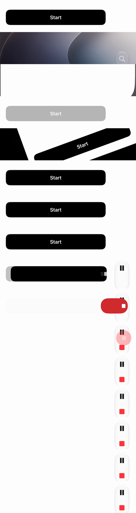
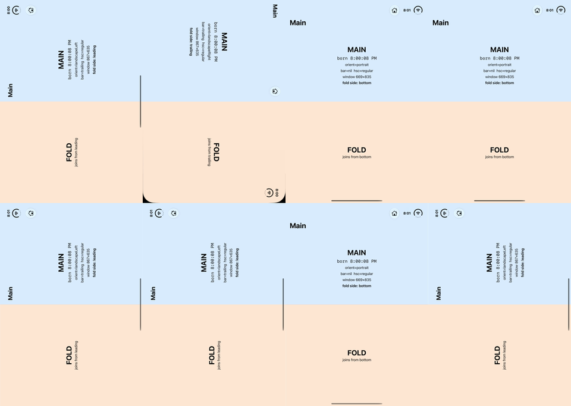
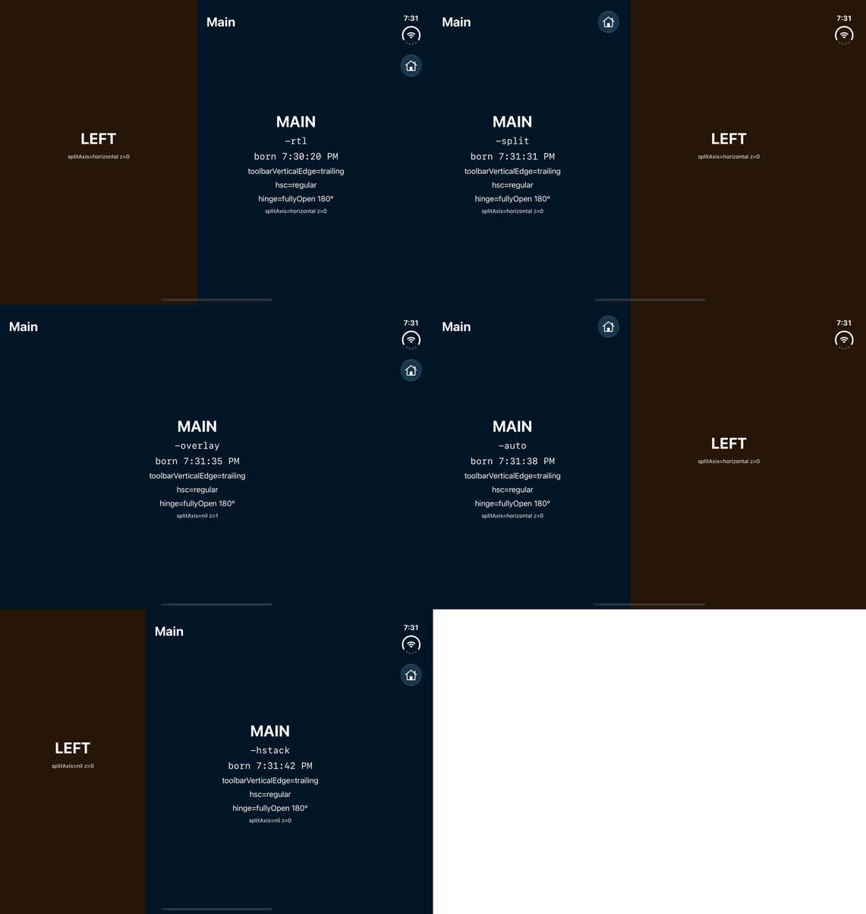

# iphone-duo — an agent skill for building iPhone Duo apps

A coding-agent skill (a `SKILL.md` with references and scripts) for designing and building SwiftUI apps
for the iPhone Duo, Apple's foldable iPhone (iOS 27.1+). Everything in it was measured on the iOS 27.1 SDK and
the iPhone Duo simulator with the lab app in this repository.

## The model

Three screens: the **cover** (单屏) outside; inside, the **main panel** (主屏, the back of the cover) and the
**split panel** (分屏) around the hinge. Three parts of an app: **Main**, the complete phone app the cover
shows; **Fold**, the page that opens on the other panel when unfolded; **Bar**, the vertical bar where the
controls live.

Two arrangements for the unfolded display — pick one per app:

| | 固定式 · fixed | 混合式 · joined |
|---|---|---|
| Main | locked to the main panel, whatever way the phone is turned | beside the Bar, relative to the window |
| Fold | always on the other panel | a sidebar on the leading side |
| Turning the phone | panes stay on their glass, only the content re-orients | the whole picture turns, like an iPad app |
| After 180° | Main on the same glass (user's left) | Main on the other glass (user's right) |
| Code | orientation table + a small UIKit probe | plain SwiftUI |
| For | content tied to a hand or a side of the table | browsing, reading, reference + content |

Folded, both show Main. Main keeps its state through every fold and turn in both.

The skill also covers what the Bar does with every toolbar construct (grouping, pinning, square buttons,
overflow, tab bars), the Xcode/SDK setup that stops the app from being letterboxed, which Duo APIs really exist
(`ArrangementView`, `onHingeChange` and `toolbarVerticalEdge` live in SwiftUICore — and why the skill does not
use `ArrangementView`), orientation and folding without a flash, and how to verify all of it in the simulator.

## Screenshots

All taken on the iPhone Duo simulator (iOS 27.1) from the sample and lab apps in this repository.

| Cover: Main alone | Unfolded, the unfold pose (both arrangements look the same here): Fold left, Main right beside the Bar |
|---|---|
|  |  |

| 固定式 fixed, phone turned 180°: Main stays on its glass (now on the left) | 混合式 joined, phone turned 180°: Main stays beside the Bar (other glass) |
|---|---|
|  |  |

| Running: Lap in the Bar, Pause + Stop pinned at the bottom | The Start button sliding into the Bar and becoming Stop (video frames) |
|---|---|
|  |  |

**Why "fixed" is called fixed** — the display's native frames (`recordVideo -noautorotate`) through four poses: Main (blue) never leaves the top panel, Fold (orange) never leaves the bottom one; only the content turns.

**The Bar gallery** (`example/DuoLab -bar1 … -bar8`) behind `references/bar.md`: grouping, styles, content kinds, overflow, placements, axis behavior + search, tab bar — and square buttons.

| Square buttons: default · `.bordered` + rounded shape (inside the bubble) · custom solid · custom glass | Apple's `ArrangementView` styles with Main as primary: the primary always lands leading, `.overlay` never shows the secondary |
|---|---|
|  |  |

## Install

Copy the `iphone-duo` folder into your agent's skills directory (`~/.claude/skills/` for a personal install, or `.claude/skills/` inside a project).

## Contents

- `iphone-duo/SKILL.md` — the model, the two arrangements, the Bar, toolchain, orientation, checklist
- `iphone-duo/references/code.md` — the patterns, all taken from the sample app
- `iphone-duo/references/bar.md` — what each toolbar construct does in the vertical bar
- `iphone-duo/references/api.md` — every Duo API in the 27.1 SDK, exercised vs. declared
- `iphone-duo/references/simulator.md` — building, folding, screenshots, video, reading app state
- `iphone-duo/scripts/` — `find-xcode.sh`, `check-api.sh`, `duo-sim.sh`, `record-frames.sh`
- `example/DuoStopwatch` — a small, complete sample app (stopwatch with lap history) with both arrangements.
  `xcodegen` in that folder, build with Xcode 27.1 for the iPhone Duo simulator.
- `example/DuoLab` — the lab app behind the measurements (needs Xcode 27.1).

---

# iphone-duo —— 开发 iPhone Duo 应用的 agent skill

一个用于设计和开发 iPhone Duo（苹果折叠屏 iPhone，iOS 27.1+）SwiftUI 应用的 agent skill（`SKILL.md` + 参考资料 + 脚本）。所有内容都在 iOS 27.1 SDK 和 iPhone Duo 模拟器上用仓库里的实验 App 实测过。

## 模型

三块屏：外面的**单屏**（封面）；里面铰链两侧的**主屏**（封面背面那半块）和**分屏**。App 的三个部分：**Main**，封面上显示的完整手机 App；**Fold**，展开后在另一半块上打开的页面；**Bar**，放操作按钮的竖栏。

展开后的两种排列，每个 App 选一种：

| | 固定式 | 混合式 |
|---|---|---|
| Main | 锁在主屏上，手机怎么转都不离开那块玻璃 | 贴着 Bar，按窗口定位 |
| Fold | 永远在另一块玻璃上 | 左侧的侧栏 |
| 转动手机 | 两块面板原地不动，只有里面的内容换向 | 整张画面像 iPad 一样整体转 |
| 翻 180° 后 | Main 还在原来那块玻璃（你的左手边） | Main 换到另一块玻璃（你的右手边） |
| 代码 | 方向表 + 一个很小的 UIKit 探针 | 纯 SwiftUI |
| 适合 | 内容和手、和桌子的一侧绑定 | 浏览、阅读、参考 + 内容 |

合上时两种都只显示 Main。两种排列里 Main 的状态在折叠和转动中都不会丢。

还包括：竖栏对每种 toolbar 写法的真实表现（成组、置底、方形按钮、溢出、标签栏）、避免黑边兼容模式的 Xcode/SDK 设置、哪些 Duo API 真实存在（`ArrangementView`、`onHingeChange`、`toolbarVerticalEdge` 在 SwiftUICore 里，以及为什么不用 `ArrangementView`）、转屏与折叠不闪屏，以及在模拟器里验证这一切的方法。

## 截图

全部在 iPhone Duo 模拟器（iOS 27.1）上用本仓库的示例和实验 App 截取。

| 封面：只有 Main | 展开（默认姿势，两种排列此时一样）：Fold 在左，Main 贴着 Bar 在右 |
|---|---|
|  |  |

| 固定式，手机翻 180°：Main 留在原来那块玻璃（现在在左） | 混合式，手机翻 180°：Main 还贴着 Bar（换到另一块玻璃） |
|---|---|
|  |  |

| 计时中：Lap 在 Bar 里，暂停 + 停止置底 | Start 按钮滑进 Bar 变成停止（录像帧） |
|---|---|
|  |  |

**固定式为什么叫固定**——屏幕原生像素帧（`recordVideo -noautorotate`）四个姿势：Main（蓝）始终在上面那块面板，Fold（橙）始终在下面那块，只有内容换向。

**竖栏 gallery**（`example/DuoLab -bar1 … -bar8`），`references/bar.md` 的依据：成组、样式、内容类型、溢出、placement、轴行为 + 搜索、标签栏——以及方形按钮。

| 方形按钮：默认 · `.bordered` + 圆角形状（套在气泡里）· 自绘实心 · 自绘玻璃 | Apple 的 `ArrangementView` 各样式（Main 为 primary）：primary 永远在 leading，`.overlay` 从不显示 secondary |
|---|---|
|  |  |

## 安装

把 `iphone-duo` 文件夹复制到 `~/.claude/skills/`（个人）或项目里的 `.claude/skills/`。

## 示例

`example/DuoStopwatch` 是一个完整的小示例（带分圈记录的秒表），两种排列都有，`references/code.md` 的代码全部出自这里。在该目录运行 `xcodegen`，再用 Xcode 27.1 编译到 iPhone Duo 模拟器。`example/DuoLab` 是实测用的实验 App。
