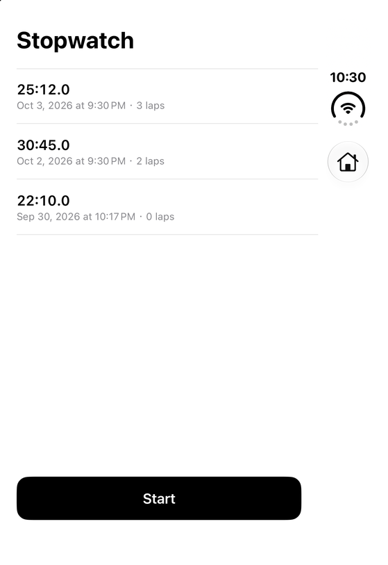
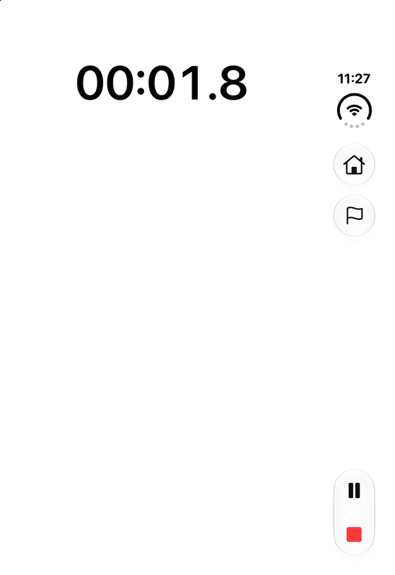
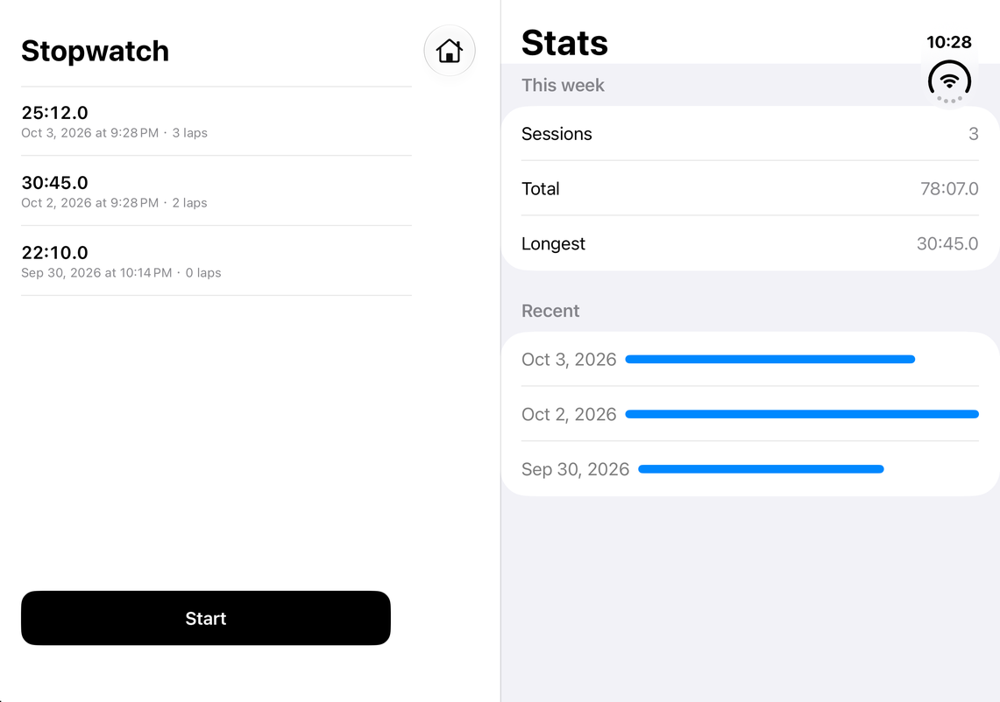
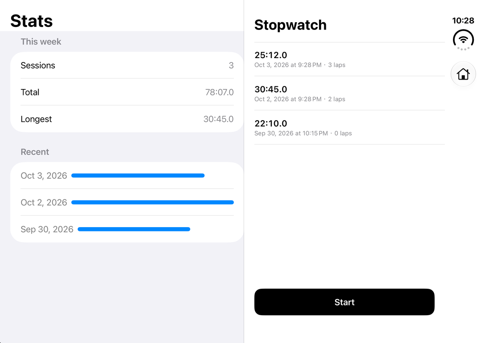
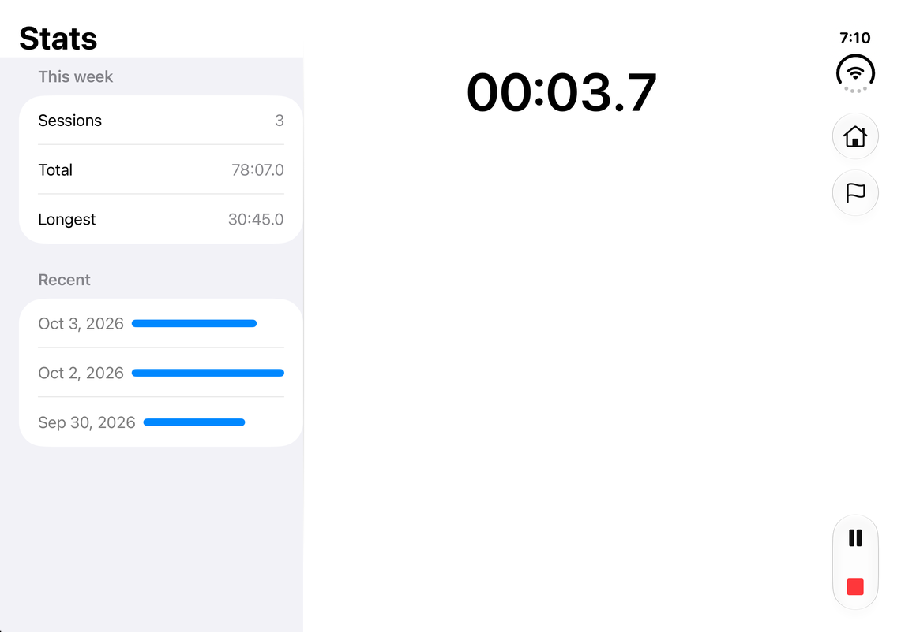
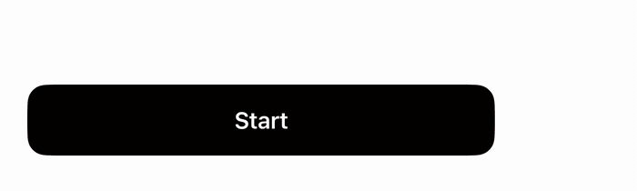
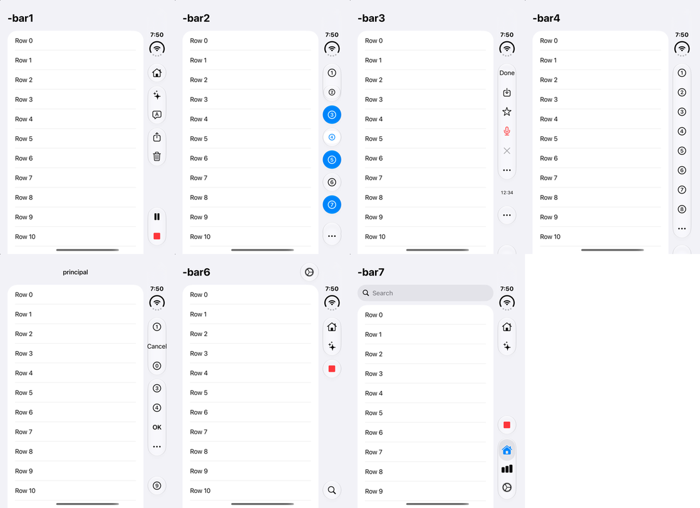
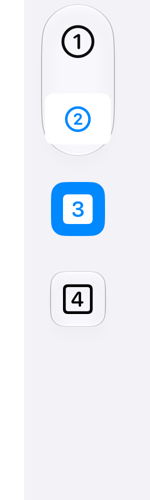

# iphone-duo —— 开发 iPhone Duo 应用的 agent skill

[English](README.md) · 中文

一个用于设计和开发 iPhone Duo（苹果折叠屏 iPhone，iOS 27.1+）SwiftUI 应用的 agent skill（`SKILL.md` + 参考资料 + 脚本）。所有内容都在 iOS 27.1 SDK 和 iPhone Duo 模拟器上用仓库里的实验 App 实测过。

## 模型

三块屏：外面的**单屏**（封面）；里面铰链两侧的**主屏**（封面背面那半块）和**分屏**。App 的三个部分：**Main**，封面上显示的完整手机 App；**Fold**，展开后在另一半块上打开的页面；**Bar**，放操作按钮的竖栏。

展开后的两种排列，每个 App 选一种：

| | 固定式 | 混合式 |
|---|---|---|
| Main | 锁在主屏上，手机怎么转都不离开那块玻璃 | 贴着 Bar，按窗口定位 |
| Fold | 永远在另一块玻璃上 | 左侧的侧栏 |
| 转动手机 | 两块面板原地不动，只有里面的内容换向 | 整张画面像 iPad 一样整体转 |
| 翻 180° 后 | Main 还在原来那块玻璃（你的左手边） | Main 换到另一块玻璃（你的右手边） |
| 代码 | 方向表 + 一个很小的 UIKit 探针 | 纯 SwiftUI |
| 适合 | 内容和手、和桌子的一侧绑定 | 浏览、阅读、参考 + 内容 |

合上时两种都只显示 Main。两种排列里 Main 的状态在折叠和转动中都不会丢。

还包括：竖栏对每种 toolbar 写法的真实表现（成组、置底、方形按钮、溢出、标签栏）、避免黑边兼容模式的 Xcode/SDK 设置、哪些 Duo API 真实存在（`ArrangementView`、`onHingeChange`、`toolbarVerticalEdge` 在 SwiftUICore 里，以及为什么不用 `ArrangementView`）、转屏与折叠不闪屏，以及在模拟器里验证这一切的方法。

## 截图

全部在 iPhone Duo 模拟器（iOS 27.1）上用本仓库的示例 App 截取。

| 封面：只有 Main | 封面，计时中：Lap 在 Bar 里，暂停 + 停止置底 |
|---|---|
|  |  |

展开，默认姿势（两种排列此时一样）：Fold 在左，Main 贴着 Bar 在右。

| 固定式，手机翻 180°：Main 留在原来那块玻璃（现在在左） | 混合式，手机翻 180°：Main 还贴着 Bar（换到另一块玻璃） |
|---|---|
|  |  |

展开，计时中：

Start 按钮滑进 Bar 变成停止：

竖栏对不同 toolbar 写法的表现（`references/bar.md`）：成组与置底 · 按钮样式 · 内容类型 · placement · 标签栏。以及方形按钮：默认、`.bordered` + 圆角形状（套在气泡里）、自绘实心、自绘玻璃。

|  |  |
|---|---|

## 安装

把 `iphone-duo` 文件夹复制到 `~/.claude/skills/`（个人）或项目里的 `.claude/skills/`。

## 示例

`example/DuoStopwatch` 是一个完整的小示例（带分圈记录的秒表），两种排列都有，`references/code.md` 的代码全部出自这里。在该目录运行 `xcodegen`，再用 Xcode 27.1 编译到 iPhone Duo 模拟器。`example/DuoLab` 是实测用的实验 App。
